## 一、项目介绍
这是一套以 **AI 应用开发实战 + Python 后端工程化** 为核心的项目教程，基于 FastAPI + LangChain + LangGraph + React 开发企业级 **RAG 智能知识库系统**，带大家掌握新时代程序员必知必会的 RAG 检索增强生成、Agentic 工作流编排、向量检索等前沿技术，大幅提升求职竞争力！

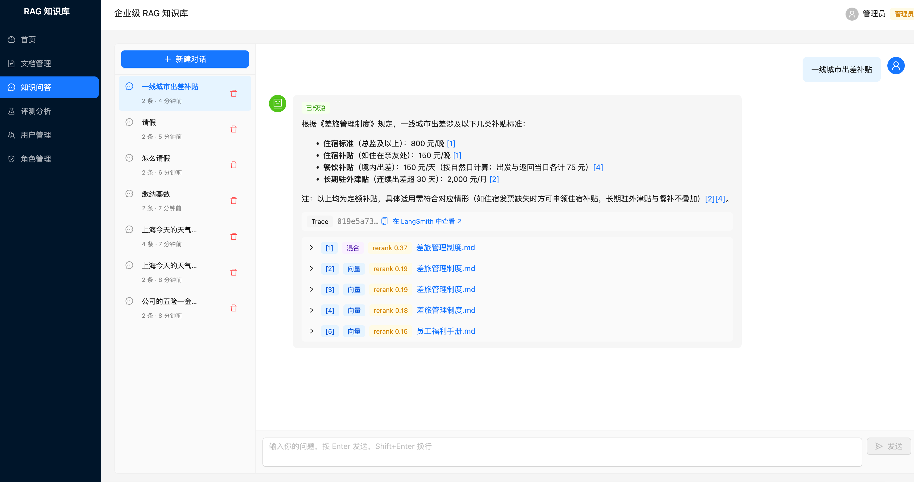

### 4 大核心能力
1）智能文档入库：用户上传 PDF / DOCX / Markdown / HTML 文档，系统自动完成解析、切分、向量化全过程，支持异步处理和状态实时反馈。

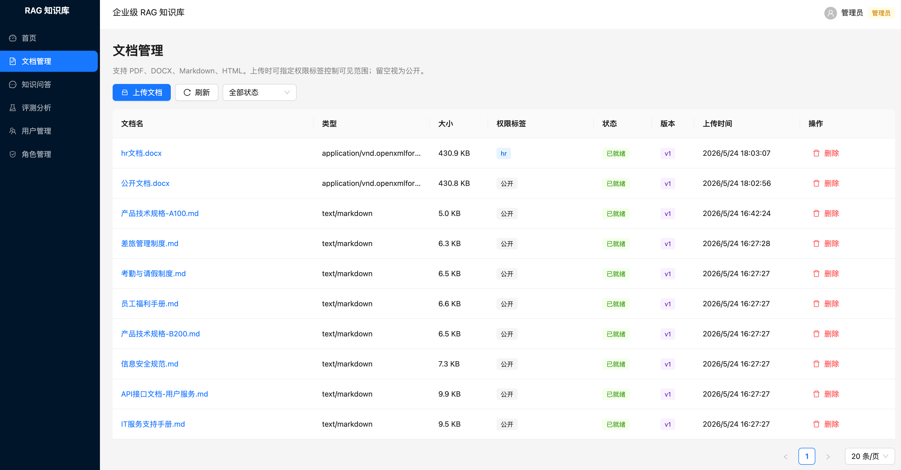

2）知识库问答：基于 LangGraph 编排的 Agentic RAG 工作流，融合向量检索与全文检索，逐 token 流式输出答案，每条回答附带来源引用，让用户知道答案依据。

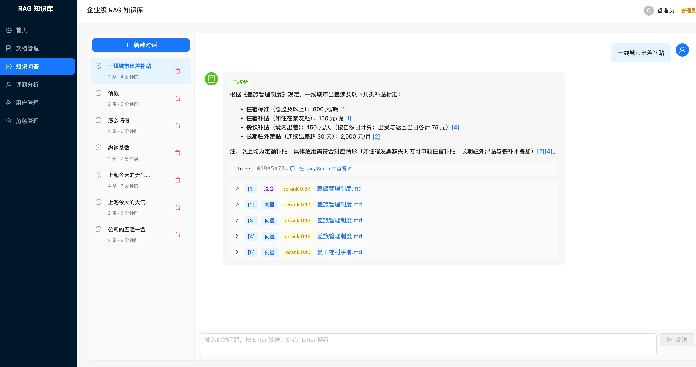

3）多轮对话与会话管理：支持上下文连续追问，AI 能理解对话历史进行多轮推理；多会话隔离，用户可以针对不同主题创建独立对话。

4）企业级工程能力：认证鉴权、文档级权限过滤、语义缓存、接口限流、全链路可观测、自动化评测、MCP Server 集成。

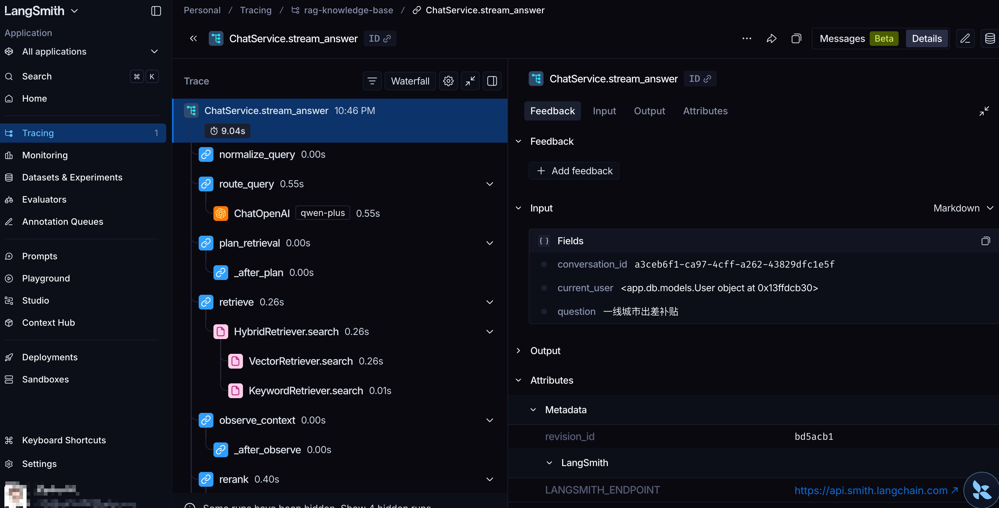

## 二、业务流程
### 核心业务流程
从用户注册登录 => 上传文档入库 => 知识库问答 => 多轮对话

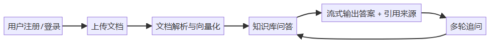

### 文档入库流程
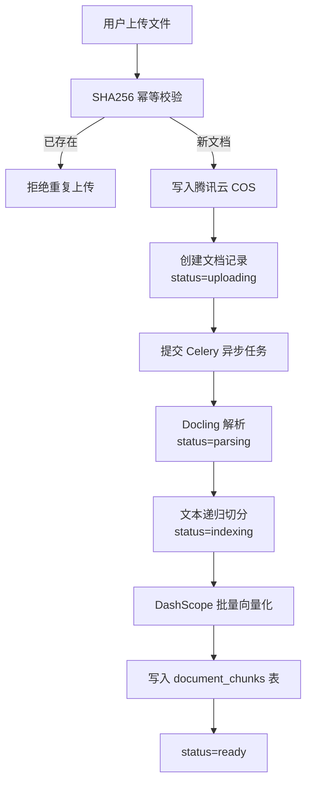

### RAG 问答流程
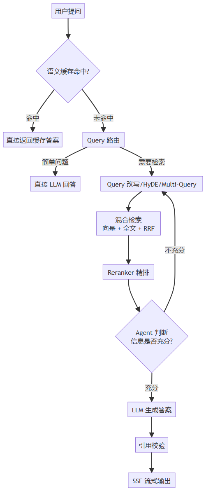

### 管理员流程
管理员可以管理用户、文档、角色权限，以及查看系统可观测性数据：

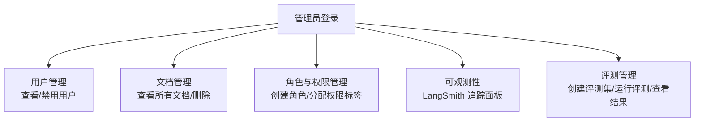

## 四、功能模块
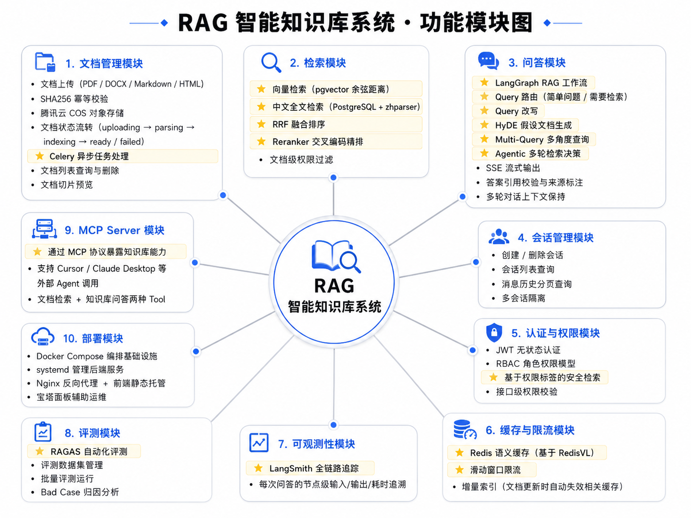

### 文档管理模块
+ 文档上传（PDF / DOCX / Markdown / HTML）
+ SHA256 幂等校验（防止重复上传）
+ 腾讯云 COS 对象存储
+ 文档状态流转（uploading → parsing → indexing → ready / failed）
+ ⭐️ Celery 异步任务处理
+ 文档列表查询与删除
+ 文档切片预览

### 检索模块
+ ⭐️ 向量检索（pgvector 余弦距离）
+ ⭐️ 中文全文检索（PostgreSQL + zhparser）
+ ⭐️ RRF 融合排序
+ ⭐️ Reranker 交叉编码精排
+ 文档级权限过滤

### 问答模块
+ ⭐️ LangGraph RAG 工作流
+ ⭐️ Query 路由（简单问题 / 需要检索）
+ ⭐️ Query 改写
+ ⭐️ HyDE 假设文档生成
+ ⭐️ Multi-Query 多角度查询
+ ⭐️ Agentic 多轮检索决策
+ SSE 流式输出
+ 答案引用校验与来源标注
+ 多轮对话上下文保持

### 会话管理模块
+ 创建 / 删除会话
+ 会话列表查询
+ 消息历史分页查询
+ 多会话隔离

### 认证与权限模块
+ JWT 无状态认证
+ RBAC 角色权限模型
+ ⭐️ 基于权限标签的安全检索
+ 接口级权限校验

### 缓存与限流模块
+ ⭐️ Redis 语义缓存（基于 RedisVL）
+ ⭐️ 滑动窗口限流
+ 增量索引（文档更新时自动失效相关缓存）

### 可观测性模块
+ ⭐️ LangSmith 全链路追踪
+ 每次问答的节点级输入/输出/耗时追溯

### 评测模块
+ ⭐️ RAGAS 自动化评测
+ 评测数据集管理
+ 批量评测运行
+ Bad Case 归因分析

### MCP Server 模块
+ ⭐️ 通过 MCP 协议暴露知识库能力
+ 支持 Cursor、Claude Desktop 等外部 Agent 调用
+ 文档检索 + 知识库问答两种 Tool

### 部署模块
+ Docker Compose 编排基础设施
+ systemd 管理后端服务
+ Nginx 反向代理 + 前端静态托管
+ 宝塔面板辅助运维

## 五、技术选型
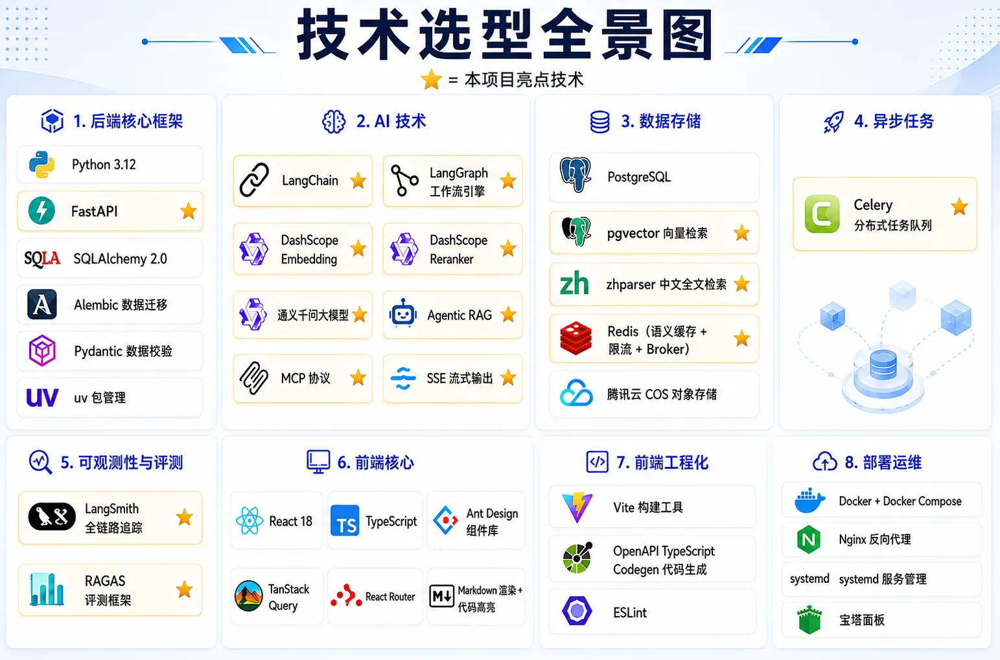

### 后端
核心：

+ Python 3.12+
+ FastAPI 框架（异步 Web 框架）
+ SQLAlchemy 2.0 ORM + Alembic 数据迁移
+ Pydantic 数据校验与序列化
+ uv 包管理工具

AI 技术：

+ ⭐️ LangChain 框架（文档处理、Embedding、检索链路）
+ ⭐️ LangGraph 工作流引擎（RAG 状态机编排）
+ ⭐️ DashScope text-embedding-v3 向量化
+ ⭐️ DashScope Reranker 精排
+ ⭐️ 通义千问 Chat 大模型
+ ⭐️ SSE 流式输出
+ ⭐️ Agentic RAG（多轮检索决策）
+ ⭐️ MCP 协议集成

数据存储：

+ PostgreSQL 数据库
+ ⭐️ pgvector 向量检索扩展
+ ⭐️ zhparser 中文全文检索扩展
+ ⭐️ Redis（语义缓存 + 限流 + Celery broker）
+ 腾讯云 COS 对象存储

异步任务：

+ ⭐️ Celery 分布式任务队列
+ Redis 作为消息 Broker 和结果 Backend

可观测性与评测：

+ ⭐️ LangSmith 全链路追踪
+ ⭐️ RAGAS 评测框架

### 前端
核心：

+ React 18 + TypeScript
+ Ant Design 组件库
+ TanStack Query 数据请求
+ React Router 路由
+ Markdown 渲染 + 代码高亮

工程化：

+ Vite 构建工具
+ OpenAPI TypeScript Codegen（自动生成 API 类型）
+ ESLint 代码校验

### 部署与运维
+ Docker + Docker Compose
+ Nginx 反向代理
+ systemd 服务管理
+ 宝塔面板

### 开发工具
+ ⭐️ Cursor AI 编辑器

## 六、架构设计
从客户端发送请求开始，自上而下经过一系列处理，最终得到响应结果。架构图如下：

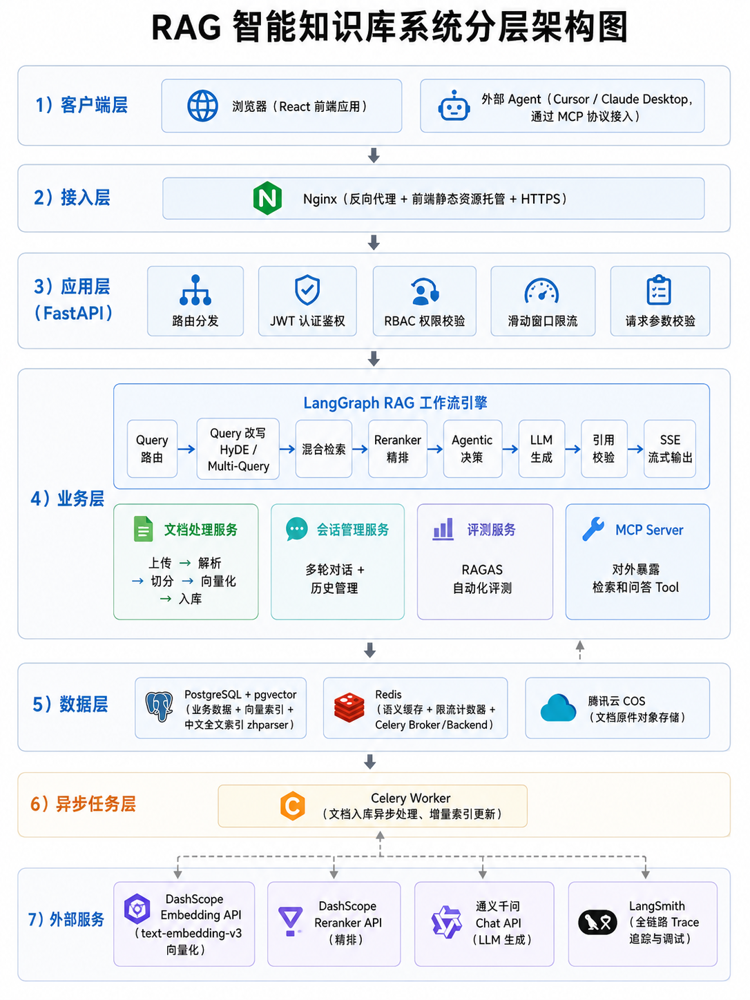

